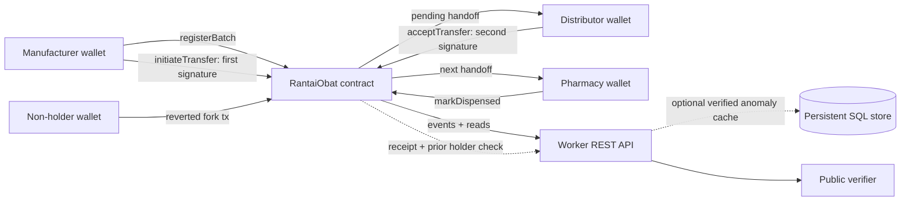

# RantaiObat (Medicine Chain)

RantaiObat is a working, two-party-signed chain-of-custody registry for pharmaceutical batches. A manufacturer registers a batch, the current holder proposes a handoff, and the recipient must co-sign before custody changes. The Solidity contract—not the UI or database—enforces ownership and prevents a non-holder from creating a fork.

Production: **https://rantaiobat.vercel.app**

## What is real in this MVP

- `RantaiObat.sol` stores batches and accepted transfers on-chain and emits an event for every state change.
- Custody changes only after two wallet actions: `initiateTransfer` and `acceptTransfer`.
- A non-current holder's `initiateTransfer` transaction reverts on-chain.
- The verifier reads batch data and complete accepted history from the contract.
- Fork evidence is stored only after the backend verifies a mined reverted transaction, its target, decoded calldata, and the sender's prior holder status.
- The custody source of truth is always the contract. Persistent anomaly storage must be configured separately on Vercel; the API reports it as unavailable instead of pretending a write succeeded.
- Registration, handoff, acceptance, dispensing, recall, and regulator flagging are real contract methods.
- QR input uses the camera through `html5-qrcode`.

The repository does **not** contain a fabricated public testnet address. Deploying to Base Sepolia requires a funded deployer key. Until one is supplied, the hosted UI honestly reports that deployment is pending.

## Architecture



## Repository map

```text
app/                    React verifier, portal, and REST routes
contracts/              Solidity contract, deployment/seed scripts, tests
db/                     Original Drizzle cache schema
drizzle/                Original cache migration
lib/                    Shared ABI and chain clients
PITCH.md                 10-minute judging script
vercel.json              Vercel production configuration
```

## Contract invariants

1. Only `batch.currentHolder` can initiate a transfer.
2. Only the proposed recipient can accept it.
3. `currentHolder` changes only during acceptance.
4. Only one handoff can be pending per batch.
5. Flagged, recalled, and dispensed batches cannot move.
6. Only the manufacturer or regulator can recall; only the regulator can flag.

## Run locally

Requirements: Node.js 22+ and a browser wallet.

```bash
npm install
cd contracts
npm install
npm test
npm run node
```

Keep the local chain running. In another terminal run `npm run deploy:local` from `contracts/`. Copy the printed address into root `.env.local`:

```dotenv
CONTRACT_ADDRESS=0x...
RPC_URL=http://127.0.0.1:8545
CONTRACT_START_BLOCK=0
```

Optionally run `npm run seed:local` from `contracts/`, then run `npm run dev` at the root. Use Hardhat's public development accounts only in a disposable wallet profile.

## Deploy the contract to Base Sepolia

Copy `contracts/.env.example` to `contracts/.env`, supply a funded testnet-only private key, and run `npm run deploy:base-sepolia`. Configure the hosted runtime with:

- `CONTRACT_ADDRESS`: deployed address
- `RPC_URL`: Base Sepolia HTTPS RPC URL
- `CONTRACT_START_BLOCK`: deployment block number

Never commit `.env`, a private key, or a paid RPC credential.

## REST API

- `GET /api/config`
- `GET /api/batches`
- `GET /api/batches/:id`
- `GET /api/batches/:id/chain`
- `GET /api/anomaly-scores/:batchId`
- `POST /api/fork-attempts` with `{ txHash, batchId }`

The fork endpoint rejects successful transactions, transactions to another contract, unrelated calldata, mismatched batch IDs, and reverted attempts made by the legitimate holder.

## Tests

`npm test` in `contracts/` compiles Solidity and proves the full two-signature path, non-holder fork rejection, and unintended-recipient rejection. The web app is validated with `npm run build`.

## Verified evidence for the pitch

BPOM's own publications report that in 2025 it tested 58,798 samples (19.2% failed requirements), revoked 1,183 permits, recommended takedown of 197,725 illegal or non-compliant sales links, and estimated Rp49.82 trillion in prevented illicit economic value. The 30 October 2025 West Jakarta operation seized 9,077 packages across 65 product items valued at Rp2.74 billion.

BPOM's later notice identifies counterfeit Codrela and Trivam Fliege and says Trivam was among the warehouse evidence. That notice was published in June 2026, so the pitch must not imply both brand findings were announced in 2025.

- [BPOM 2025 oversight results](https://www.pom.go.id/siaran-pers/jejak-2025-arah-2026-cerita-pengawasan-dan-misi-perlindungan)
- [West Jakarta illegal warehouse](https://www.pom.go.id/berita/bongkar-gudang-farmasi-ilegal-di-jakarta-barat-bpom-dan-polda-metro-jaya-sita-produk-ilegal-bernilai-rp2-74-miliar)
- [BPOM counterfeit Codrela/Trivam notice](https://www.pom.go.id/siaran-pers/bpom-tindak-pelaku-peredaran-obat-palsu-merek-codrela-dan-trivam-fliege)

## Honest MVP boundary

The core chain flow, verifier, anomaly validation, and persistence are implemented. A public testnet deployment cannot be completed without an externally funded deployer wallet. The portal relies on the wallet transaction for authorization; a separate EIP-4361 server session is not required for contract safety and is intentionally not faked. A production release should add organization-to-license verification, scheduled indexing, evidence uploads, audits, and monitoring.
